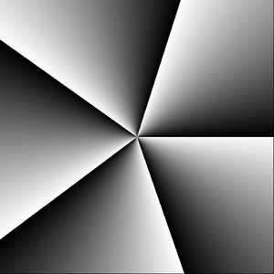
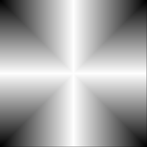
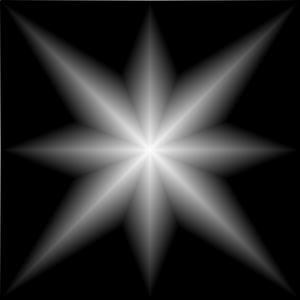
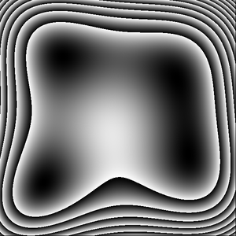
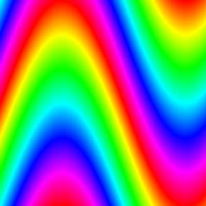
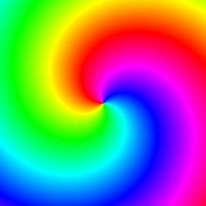

[Procedural texture](https://en.wikipedia.org/wiki/Procedural_texture) - 2D [color gradient](https://en.wikipedia.org/wiki/Color_gradient)


# images

## gray = 8 bit color ( c images ) 
 
 
 
 
 

 
 
 
 
 

 

 


## pascal images (up to 24 bit color)

 
 
 
 
 


 
 
 
 
 


 
 
 
 
 


 

 


# Theory
* scalar 2D field 
* function f : (R x R) maps to  color


# Functions

## pascal

```pascal
Function Projection(center:TPoint;height:integer;x,y:integer;FunctionType:TFunctionType):integer;
  // F: C --> R
  //var r:extended; //radius
  begin

     case FunctionType of
            HSV:        result:= Point2Color(X,y);
            AbsZ:       result:=round(sqrt(sqr(X-center.X)+sqr(y-center.Y)));
            ArgZ:       result:=round(RadToDeg(Pi+ArcTan2(y-center.Y,center.X-x)));
            Whirl:      result:=round(sqrt(sqr(X-center.X)+sqr(y-center.Y))+RadToDeg(2*Pi+ArcTan2(y-center.Y,center.X-x)));
            ReZ:        result:=y ;  // horizontal lines
            Saddle:     result:=abs(sqr(x-center.X)-round(sqr(y-center.y) / 2)) ;
            RePlusIm:   result:=y+x;
            MaxReIm:    result:=max(abs(center.x-x),abs(center.Y-y)); // or
            AbsReIm:    result:=abs((center.x-x)*(center.Y-y));           // biomorph
            ImDivRe:    result:=floor(tan((center.Y-y) / (center.X-x+0.000001)));  //
            ImReDiv:    result:=y+x+(100*y div (x+1));
            manhattan:  result:=sqr(abs(center.X-x)+abs(center.Y-y));                                                              // ClientHeight*(sin+1)/2= [0,ClientHeight]

            sinusX:     result:=round(bitmapa.Width*sin(Pi*DegToRad(x)));
            Sinus:      result:=y+round(height*(sin(Pi*DegToRad(x))+1)/8);
            // sin   is in  [-1,+1]
            // (sin+1)      [0,2]
            // (sin+1)/2    [0,1]
            SinusXY:    result:=y+round(height*(sin(Pi*DegToRad(x + y))+1)/8);
            SinusXmY:   result:=y+round(height*(sin(Pi*DegToRad(x*y))+1)/8);
            SinXSinY:   result:=round(
                              (height
                              *
                              (2+sin(Pi*DegToRad(y)) + sin(Pi*DegToRad(x))))
                              /4
                              );//try to change numerical values
            sinXYXY:     result:=round
                              (
                                height
                                *
                                (2+sin(Pi*DegToRad(y)) + sin(Pi*DegToRad(x))+sin(Pi*DegToRad(x+y)))/8
                                );
            XorY:         result:=x or  y;
            XxorY:        result:=x xor y;
            XshlY:        result:=x shl y;
            XshrY:        result:=x shr y;
            XandY:        result:=x and y;
            sqrtM:        result:=round(sqrt(x*y)) ;
            ftMax:        result:=Round((center.Y-y) / sqr(center.X -x + 0.0001));
            plasma: result:=round(bitmapa.Width*sin(Pi*DegToRad(x)));
            else          result:=y; //
          end; // case
  end;

```
## c

```c
double conic(double complex z)
{
  double argument;
  
  argument = carg(z); //   argument in radians from -pi to pi
  
  argument = fabs(argument)/ M_PI;
      
  return argument; // argument in range from 0.0 to 1.0
}
```

```c

// https://en.wikipedia.org/wiki/Himmelblau%27s_function
double GiveHimmelblau(double x, double y){
	// mapped input to [-6,6]x[-6,6]
	x *= 6.0;
	y *= 6.0;
	double a = x*x+y-11.0;
	double b = x+y*y-7.0;
	// mapped output to 
	 return (a*a + b*b)/200.0;

}
```


```c
/*
	https://iquilezles.org/www/articles/checkerfiltering/checkerfiltering.htm
	checkers, in mod form
*/
double checker( double x, double y){

	int ix = floor(5.0*x);
	int iy = floor(5.0*y);


	return abs(ix + iy) % 2;
}
```

```c
/* 
 r is the smooth potential and phi is the final angle
 code by xenodreambuie : "I call this texture pyramids. My code in Pascal for the Star8 texture is "
 
 
*/ 

double GiveStar8(double r, double phi){
	double fr;
	double fphi;
	double t;
	double g;
	
	fr = fabs(frac(r));
  	fphi = fabs(frac(phi));
  	if (fphi>fr) {
    		t= fr; 
    		fr= fphi; 
    		fphi=t;
    		}
  
	g = 1+1.5*fphi-2.5*fr;
	t = 1-2.5*fphi-fr;
	if (t> g) 
	  	{ g = t;}
	if (g<0)
  		{g=0;}
  	
	return g;
}
```


# files
* [ColorM.pas](./src/pas/ColorM.pas)  
* [Rainbow.exe](./exe/Rainbow.exe) - windows executable program, can be run also on linux
* [d.c](./src/c/d.c) - c version of Rainbow program
* [g.sh](./src/c/g.sh) bash script for converting ppm files to png


# See also
* [island-gradient by Code 2D](https://code2d.wordpress.com/2020/07/21/island-gradient/)
* [2D distance functions by inigo quilez ](https://www.iquilezles.org/www/articles/distfunctions2d/distfunctions2d.htm)
* [a-simple-procedural-texture-algorithm by by Herman Tulleken ](http://www.code-spot.co.za/2008/11/07/a-simple-procedural-texture-algorithm/)

# color
## color modes
* 24 bit color (rgb), color function tecza ( 1D color gradient ) 
* gray shades (skala szarosci where r=g=b)
* direct kolor( kolor 24 bitowy , ale adresowanie bezposrednie wg numerów koloru)
* Black and White 

## color functions
* [ColorM.pas](./src/pas/ColorM.pas) - color functions in pascal ( Delphi)


# run

## pascal

On linux ( tested on Ubuntu 20.04): 
```
wine ./Rainbow.exe
wine ./exe/Rainbow.exe

```


# History

   

Old ( but still interesting) Pascal ( Borland Delphi 7.0 personal edition )  program Rainbow for windows ( but can also be run on Linux using wine)

dead old www address: fraktal.republika.pl/tecza.html

Last modification: 2005-05-29 


# Licence and contributors
* [licence](LICENCE) - GNU General Public License v3.0
* function [star8 by xenodreambuie ( pascal) ](https://fractalforums.org/programming/11/how-many-different-ways-are-there-to-show-such-set/3874/msg25389#msg25389)
* FUNCTION HSVtoColor from UNIT HSVLibrary ( efg, July 1999  www.efg2.com/lab  Copyright 1999, All Rights Reserved. May be used freely for non-commercial purposes.
* Function Rainbow by  Witold J.Janik; WJJ@CAD.PL thx for  Andrzeja W¹sika from pl.comp.lang.delphi  http://4programmers.net/view.php?id=201
  

# Git


create a new repository on the command line

```git
echo "# Procedural-texture" >> README.md
git init
git add README.md
git commit -m "first commit"
git branch -M main
git remote add origin https://github.com/adammaj1/Procedural-texture.git
git push -u origin main
```               


## Subdirectory

```git
mkdir images
git add *.png
git mv  *.png ./images
git commit -m "move"
git push -u origin main
```
then link the images:

```txt
 

```

```git
gitm mv -f 
```

## markdown
* [mastering-markdown](https://guides.github.com/features/mastering-markdown/)

## authenticate

[automatically-authenticate-into-github](https://stackoverflow.com/questions/28298861/how-to-automatically-authenticate-into-github-from-git-bash-using-my-public-and)  

```git
git remote set-url origin git@github.com:adammaj1/Procedural-texture.git
```
